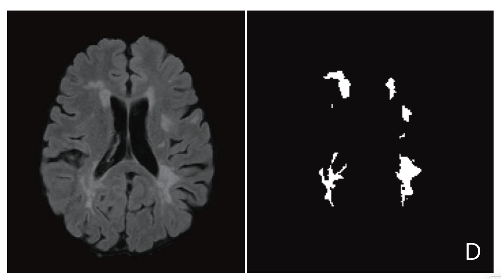
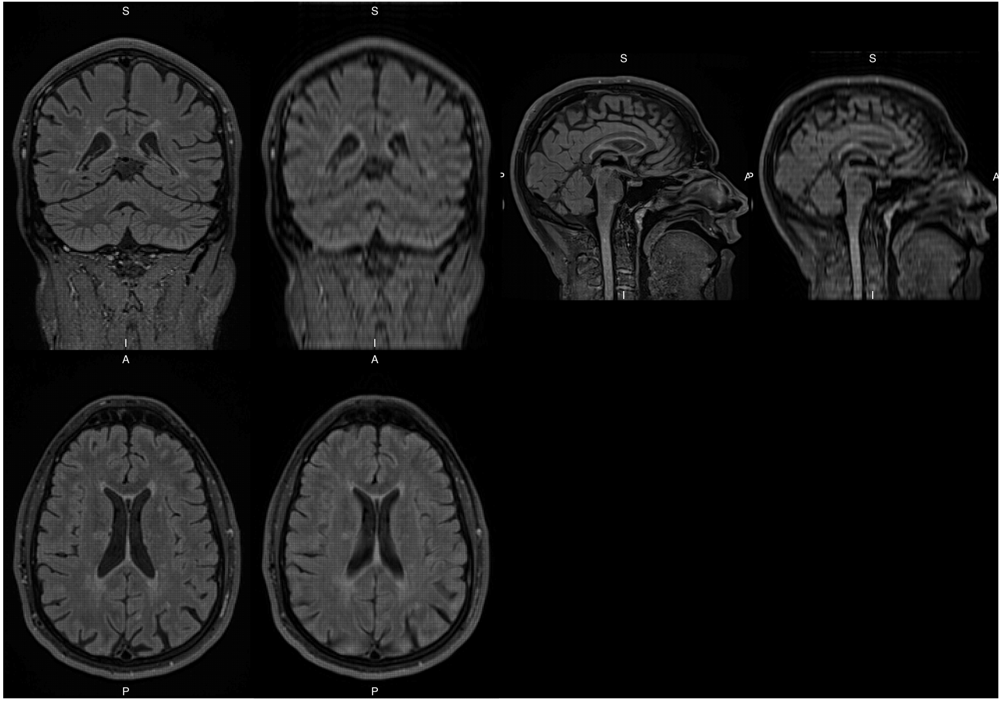
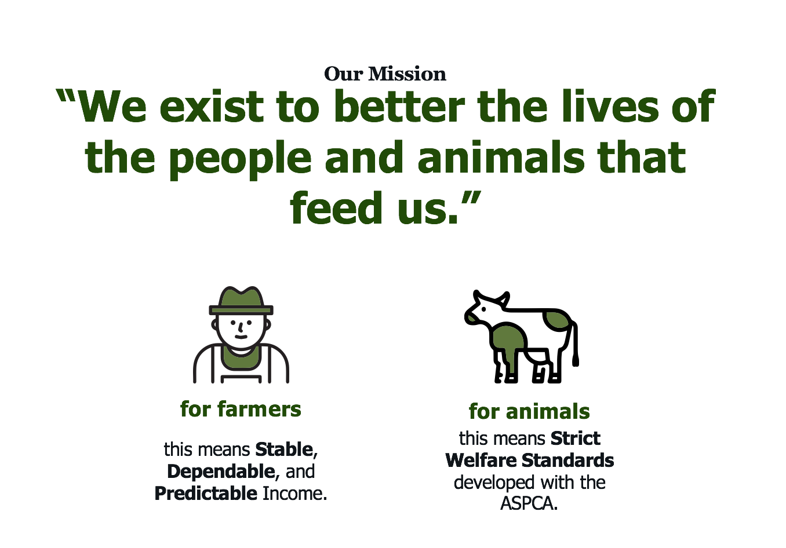
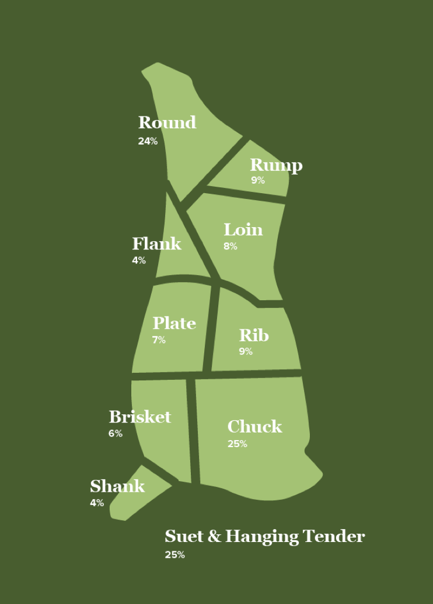
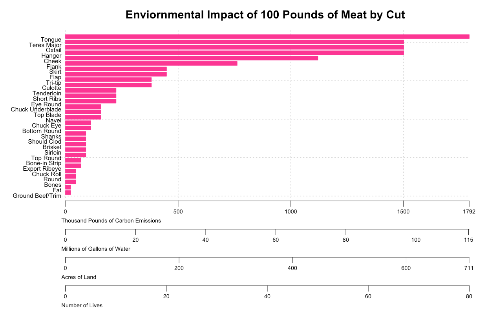
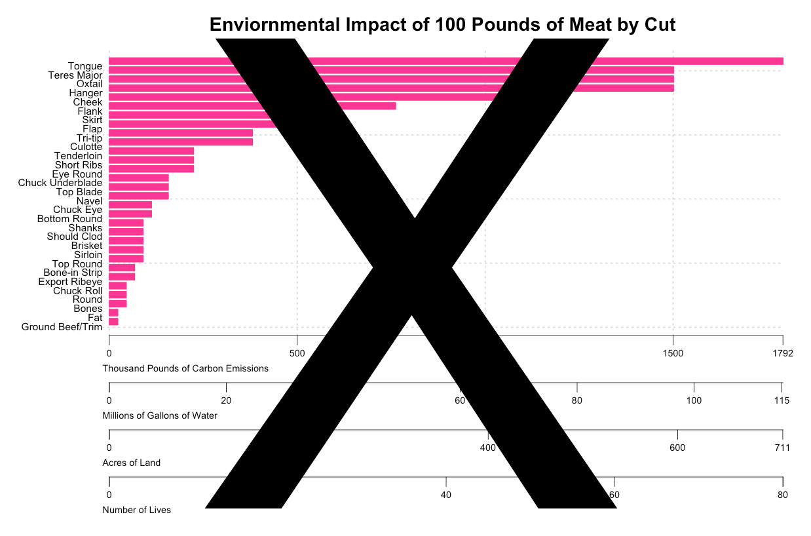

```{r setup, include=FALSE}
library(wesanderson)
library(knitr)
library(ggplot2)
library(dplyr)
knitr::opts_chunk$set(echo = FALSE)
```

## Who Am I? 

```{r, out.width = "65%", echo = FALSE, fig.align = "center"}
include_graphics('logos.png')
```


## Who Am I? 

<br>


```{r, out.width = "65%", echo = FALSE, fig.align = "center"}

```


## Who Am I? 

<br>


```{r, out.width = "65%", echo = FALSE, fig.align = "center"}

```


## Happy Valley Meat Company  

<br>

```{r, out.width = "70%", echo = FALSE, fig.align = "center"}

```

## Happy Valley Meat Company  

<br>

Happy Valley Meat Company works with some pretty well known restaurants... 

<br> 

Momofuku Ko

Momofuku Ssam Bar

The Dutch

Dig Inn 

Fette Sau

Frenchette


## Happy Valley Meat Company  

<br> 

```{r, out.width = "35%", echo = FALSE, fig.align = "center"}

```


## The Data   


The weight of each cut of meat on one beef animal: 

```{r, echo = FALSE}
carcass_calculator_data <- read.csv('carcass_calculator_data.csv')
```


```{r, echo = FALSE}
knitr::kable(head(carcass_calculator_data, n = 10L))
```

## The Data   


```{r, echo = FALSE, fig.center = TRUE, out.width = "70%"}

values=wes_palette(n=4, name="Darjeeling1")

plot_data <- carcass_calculator_data %>%
  mutate(cut = reorder(cut, total_weight))

plot.out <- ggplot(plot_data, 
                   aes(x = cut,
                       y = total_weight)) + 
  geom_bar(stat="identity", fill = values[1]) + 
  coord_flip() + 
  xlab('') +
  ylab('Weight (in pounds)') + 
  theme(legend.position="none") + 
  ggtitle(paste0('Weight of Each Cut Per Animal')) + 
  theme(axis.title=element_text(size=12),
        plot.title=element_text(size = 16))

plot.out
```  


## The Data   


```{r, echo = FALSE, out.width = "70%"}

values=wes_palette(n=4, name="Darjeeling1")

cut.list <- c('Tongue',
              'Ground Beef',
              'Tenderloin',
              'Bone-in Ribeye',
              'Skirt')

plot.out %+% filter(plot_data, cut %in% cut.list) + 
  theme(axis.text=element_text(size=14))

```  

    
    
## The Data

```{r, out.width = "15%", echo = FALSE, fig.align = "center"}

```


```{r, echo = TRUE}
##constants
water.rate <- 6.36 #(million gallons of water per 1 animal) 
co2.emision <- 102.96 #(thousand lbs of co2 emissions per 1 animal) 
land.use <- 77 #(acres of land per 1 animal)
```

<br>

Source: Ranganathan, Janet, et al. "Shifting diets for a sustainable food future." World Resources Institute (2016).


## The Data

```{r, message = FALSE, echo = TRUE}
##load in the dplyr library
library(dplyr)

##entry weight for pound of meat
weight = 100

## calculations for enviornmental impact  
carcass_calculator_data_100_pounds <- carcass_calculator_data %>%
  mutate(number_cows = ceiling(weight/total_weight)) %>% 
  select(-total_weight)
```

## The Data

The number of beef animals required for 100 pounds of each cut:

```{r, echo = FALSE}
knitr::kable(head(carcass_calculator_data_100_pounds, n = 10L))
```


## The Data


```{r, message = FALSE, echo = TRUE}
##calculate the enviornmental impact 
carcass_calculator_data_100_pounds <- carcass_calculator_data_100_pounds %>% 
  mutate(water_rate = water.rate * number_cows) %>% 
  mutate(co2_emission = co2.emision * number_cows) %>% 
  mutate(land_use = land.use * number_cows) 
```


## The Data


The enviornmental impact for 100 pounds of each of the following cuts: 


```{r, echo = FALSE}
knitr::kable(head(carcass_calculator_data_100_pounds, n = 10L))
```


## Animal Lives

```{r, echo = TRUE, message = FALSE}
## load in the required the packages 
library(ggplot2)
library(wesanderson)

##create a color palette
values=wes_palette(n=4, name="Darjeeling1")

##reorder the data in order of number of cows 
plot.data <- carcass_calculator_data_100_pounds %>% 
  mutate(cut = reorder(cut, number_cows))

##plot th data in a barplot 
plot.out <- ggplot(plot.data, 
                   aes(x = cut, 
                       y = number_cows)) + 
  geom_bar(stat="identity", fill = values[4]) + 
  coord_flip() + 
  xlab('') + 
  ylab('Animals') + 
  theme(legend.position="none",
        axis.title=element_text(size=12),
        plot.title=element_text(size = 16)) + 
  ggtitle(paste0('Animals for ', weight, ' Pounds of Meat by Cut'))
```  


## Animal Lives

```{r, echo = FALSE, out.width = "60%"}
plot.out
```  

## Animal Lives

```{r, message = FALSE, fig.align = "center"}
library(wordcloud) 
wordcloud(plot.data$cut, plot.data$number_cows, colors = values)

```
  
## Animal Lives

The %+% function allows you to replace the data frame that you are using with ggplot! 

```{r, echo = TRUE, eval = FALSE, out.width = "60%"}
## make a vector of a subset of the cuts  
cut.list <- c('Tongue',
              'Ground Beef',
              'Tenderloin',
              'Bone-in Ribeye',
              'Skirt')

## plot the data for the subset of the cuts
plot.out %+% filter(plot.data, cut %in% cut.list) + 
  theme(axis.text=element_text(size=14))
```  


## Animal Lives

```{r, echo = FALSE, eval = TRUE, out.width = "60%"}
cut.list <- c('Tongue',
              'Ground Beef',
              'Tenderloin',
              'Bone-in Ribeye',
              'Skirt')

plot.out %+% filter(plot.data, cut %in% cut.list) + 
  theme(axis.text=element_text(size=14))
```  


## Animal Lives

```{r, echo = TRUE, eval = FALSE, out.width = "60%"}
library(plotly)
ggplotly(plot.out, tooltip = c("x", "y"))
``` 

## Animal Lives

```{r, echo = FALSE, eval = TRUE, out.width = "60%", message = FALSE}
library(plotly)
ggplotly(plot.out, tooltip = c("x", "y"))
``` 

## Animal Lives
  
```{r, echo = FALSE, eval = TRUE, out.width = "60%", message = FALSE}
library(plotly)
ggplotly(plot.out %+% filter(plot.data, cut %in% cut.list) +
           theme(axis.text=element_text(size=14)), tooltip = c("x", "y"))
```   

  


## Co2 Emissions 

```{r, out.width = "60%"}
plot.out <- ggplot(plot.data, 
                   aes(x = cut, 
                       y = co2_emission)) + 
  geom_bar(stat="identity", fill = values[2]) + 
  coord_flip() + 
  xlab('') + 
  ylab('Co2 Emissions (in thousands of pounds)') + 
  theme(legend.position="none",
        axis.title=element_text(size=12),
        plot.title=element_text(size = 14)) + 
  ggtitle(paste0('Co2 Emissions for ', weight, ' Pounds of Meat by Cut'))
 
ggplotly(plot.out %+% filter(plot.data, cut %in% cut.list) +
           theme(axis.text=element_text(size=14)), tooltip = c("x", "y"))
   
``` 

  
  
## Water Usage 

```{r, out.width = "60%"}
plot.out <- ggplot(plot.data, 
                   aes(x = cut, 
                       y = water_rate)) + 
  geom_bar(stat="identity", fill = values[3]) + 
  coord_flip() + 
  xlab('') + 
  ylab('Water Usage (in millions of gallons)') + 
  theme(legend.position="none",
        axis.title=element_text(size=12),
        plot.title=element_text(size = 14)) + 
  ggtitle(paste0('Water Usage of ', weight, ' Pounds of Meat by Cut'))
 
ggplotly(plot.out %+% filter(plot.data, cut %in% cut.list) +
           theme(axis.text=element_text(size=14)), tooltip = c("x", "y"))
   
``` 

  
  
## Land Usage 

```{r, out.width = "60%"}
plot.out <- ggplot(plot.data, 
                   aes(x = cut, 
                       y = land_use)) + 
  geom_bar(stat="identity", fill = values[1]) + 
  coord_flip() + 
  xlab('') + 
  ylab('Land Usage (in acres)') + 
  theme(legend.position="none",
        axis.title=element_text(size=12),
        plot.title=element_text(size = 14)) + 
  ggtitle(paste0('Land Usage of ', weight, ' Pounds of Meat by Cut'))

 
ggplotly(plot.out %+% filter(plot.data, cut %in% cut.list) +
           theme(axis.text=element_text(size=14)), tooltip = c("x", "y"))
   
``` 

## Plot All Together 
  
```{r, out.width = "70%", echo = FALSE, fig.align = "center"}

```  


## Plot All Together 
  
```{r, out.width = "70%", echo = FALSE, fig.align = "center"}

```  


## Other Plotly Projects: Hiking Trails 

<br>

```{r, out.width = "70%", echo = FALSE, fig.align = "center"}

``` 


## Other Plotly Projects: Hiking Trails 

<br>

```{r, out.width = "70%", echo = FALSE, fig.align = "center"}

``` 


## Other Plotly Projects: Hiking Trails 


```{r}
devils.path <- read.csv('Devils_Path.csv') %>% 
  select(Lat, Lng, Distance..miles., Elevation..feet.	)
knitr::kable(head(devils.path))
```

## Other Plotly Projects: Hiking Trails

```{r, echo = TRUE, eval = FALSE}
x <- list(
  title = "Distance (in miles)"
)

y <- list(
  title = "Elevation (in feet)"
)

plot_ly(data = devils.path,
        x = ~Distance..miles.,
        y = ~Elevation..feet.,
        type = 'scatter', 
        mode = 'lines',
        color = I('purple'),
        hoverinfo = 'text',
        text = paste(
          round(devils.path$Distance..miles., 1), 
          "miles, ",                    
          round(devils.path$Elevation..feet., 0),
          "feet elevation"),
        fill = 'tozeroy')  %>%
  layout(xaxis = x, 
         yaxis = y,
         title = "The Devil's Path",
         shapes=list(type='line', 
                     y0= 3500, 
                     y1= 3500, 
                     x0=min(devils.path$Distance..miles.),
                     x1=max(devils.path$Distance..miles.),
                     line=list(dash='dot', width=1)))
```


## Other Plotly Projects: Hiking Trails

```{r}
x <- list(
  title = "Distance (in miles)"
)

y <- list(
  title = "Elevation (in feet)"
)

plot_ly(data = devils.path,
        x = ~Distance..miles.,
        y = ~Elevation..feet.,
        type = 'scatter', 
        mode = 'lines',
        color = I('purple'),
        hoverinfo = 'text',
        text = paste(
          round(devils.path$Distance..miles., 1), 
          "miles, ",                    
          round(devils.path$Elevation..feet., 0),
          "feet elevation"),
        fill = 'tozeroy')  %>%
  layout(xaxis = x, 
         yaxis = y,
         title = "The Devil's Path",
         shapes=list(type='line', 
                     y0= 3500, 
                     y1= 3500, 
                     x0=min(devils.path$Distance..miles.),
                     x1=max(devils.path$Distance..miles.),
                     line=list(dash='dot', width=1)))
```


## Shiny App! 

https://emsweene.shinyapps.io/carcass_calculator_4/

